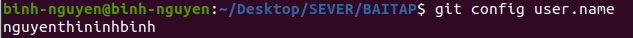
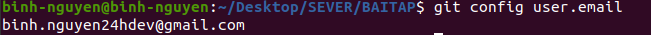
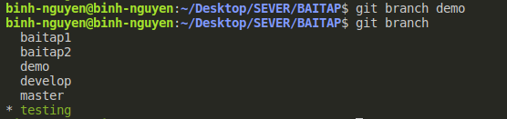

1/ Config local user.name và user.email của mình.

- git config user.name

  

- git config user.email

  

2/ Tạo một file README.md, commit và push.

3/ Tạo một branch mới với name “demo” và sau đó đổi tên thành “develop”

- git branch demo
  
