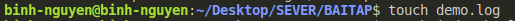
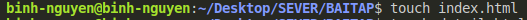
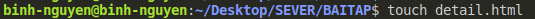

# BAITAPGITHUB

4/ Trên nhánh “develop”, tạo môt file demo.log, index.html, detail.html. Làm thế nào để git không tracking những file \*.log. Sau đó tạo một commit.

- tao file demo.log: touch demo.log

- tao file index.html: touch index.html

- tao file detail.html

